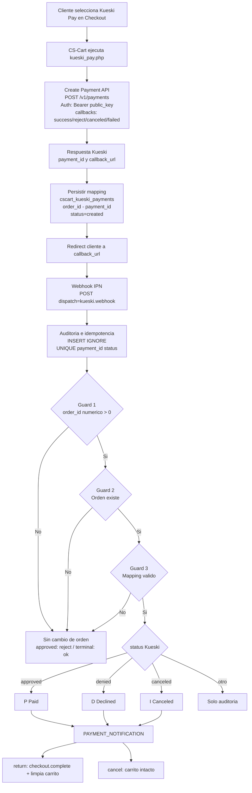

**Versión:** 1.13 — **Fecha:** 2026-03-03  
**Responsables:** Víctor / Carlos  
**Plataforma:** CS-Cart 4.19.1.SP2  
**Entorno activo:** DEV — `https://dev.importacionesamexico.com.mx`

---

## Objetivo

Integrar Kueski Pay como método de pago en CS-Cart, permitiendo a los clientes 
financiar sus compras directamente desde el checkout. La integración cubre el 
flujo completo: creación de pago, redirección al widget de Kueski, notificación 
vía webhook, actualización automática del estado de la orden y reembolsos totales.

---

## Entornos

| Entorno | Base URL | Credenciales | Estado |
| :--- | :--- | :--- | :--- |
| **Sandbox** | `https://payments-api.sandbox-pay.kueski.codes` | API Key ejemplo Kueski | ✅ Validado |
| **Testing** | `https://testing.kueskipay.com` | Pendiente | ⚠️ Sin credenciales propias |
| **Production** | `https://api.kueskipay.com` | Pendiente | ⏳ Post-certificación |

> El selector de ambiente se configura desde el panel de administración de CS-Cart
> en **Addons → Kueski Pay → Configuración**.

---

## Estado actual

| Componente | Descripción | Estado |
| :--- | :--- | :--- |
| Webhook IPN | Recepción + respuesta JWT HS256 | ✅ Estable |
| Idempotencia | `INSERT IGNORE` + `UNIQUE KEY (payment_id, status)` | ✅ Blindada |
| Race condition | Validado con 20 concurrentes | ✅ Cubierta |
| Payment Processor | Creación de pago + redirect | ✅ Implementado |
| Regla de reintento | Por status (`created/approved/terminal`) | ✅ Implementada |
| Guards webhook | `order_id` numérico + orden existe + mapping válido | ✅ Validados |
| Selector de ambiente | `sandbox / testing / production` | ✅ Validado |
| Widget PDP | Frontend completo | ✅ Implementado |
| Widget PDP (api_key) | Habilitación api_key propia | ⏳ Pendiente Brenda |
| Condicional min/max | Ocultar Kueski Pay fuera de límites ($60–$25,000 MXN) | ✅ Implementado |
| Reembolsos | Módulo completo — validado en staging | ✅ Implementado |
| Certificación formal | 3 pruebas (Success, Denied, Cancelled) | ⏳ En espera Brenda |
| Logs sensibles PROD | Apagar en producción | ⏳ Post-certificación |
| Rollback plan | — | ⏳ Post-certificación |

---

## Flujo general

<Note>

Este diagrama describe el flujo completo de la integración:

1. Creación del pago (`POST /v1/payments`)
2. Redirección al widget de Kueski
3. Recepción del webhook (IPN)
4. Validación mediante guards e idempotencia DB-level
5. Mapeo de estados hacia CS-Cart (`P`, `D`, `I`)

</Note>

---

## Autenticación

| Operación | Método | Credencial |
| :--- | :--- | :--- |
| Create Payment | `Authorization: Bearer {public_key}` | API Public Key |
| Webhook response | `Authorization: Bearer {JWT HS256}` | Firmado con `api_secret` |
| Refunds | `Authorization: Bearer {JWT HS256}` | Firmado con `api_secret` |

---

## Checklist vs Guía oficial Kueski Pay

| Sección | Descripción | Estado |
| :--- | :--- | :--- |
| Create Payment | `POST /v1/payments` | ✅ |
| Headers `Kp-*` | `Kp-Name`, `Kp-Version`, `Kp-Source`, `Kp-Trigger` | ✅ |
| Amount Object | `total`, `currency` | ✅ |
| Item Object | `name`, `description`, `quantity`, `price`, `currency`, `sku`, `tax` | ✅ |
| Callbacks Object | `on_success`, `on_reject`, `on_canceled`, `on_failed` | ✅ |
| Duplicate Order ID | Manejo por status | ✅ |
| Shipping Object | Opcional | ⚠️ Pendiente post-cert |
| Billing Object | Opcional | ⚠️ Pendiente post-cert |
| IPN / Webhook | Recepción + respuesta JWT HS256 | ✅ |
| Refunds | `POST /api/refunds` | ✅ Implementado y validado staging |
| Validate API Keys | `GET /v1/validate-keys` | ⏳ Post-cert |
| Widget PDP | Frontend ✅ / api_key pendiente Brenda | ⚠️ Parcial |
| Widget Checkout | No requerido (confirmado Brenda) | ✅ Descartado |

---

## Mapeo de estados webhook → CS-Cart

| Status Kueski | Estado CS-Cart | Código |
| :--- | :--- | :--- |
| `approved` | Paid | `P` |
| `denied` | Declined | `D` |
| `canceled` / `cancelled` | Canceled | `I` |

---

## Contacto Kueski

| Rol | Nombre | Contexto |
| :--- | :--- | :--- |
| Certificación | Brenda Aranza Garcia Solorio | Ejecuta las 3 pruebas desde el simulador |