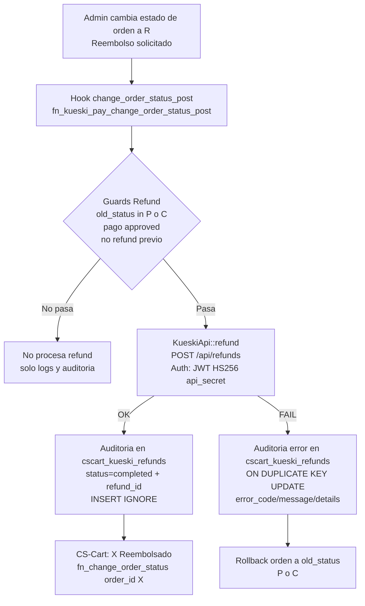

<Info>
  **Versión:** 2.1 — **Fecha:** 2026-03-02  
  **Responsables:** Víctor / Carlos  
  **Estado:** ✅ Implementado y validado en Staging
</Info>

<Note>
  Este documento es parte de la documentación técnica del addon Kueski Pay.  
  Para el historial completo de cambios ver [Checkpoint Técnico](/ecommerce/kueski-pay/kueski-pay-checkpoint).
</Note>

## 1. Contexto

Los reembolsos no son requeridos para la certificación con Brenda (Success, Denied, Cancelled), pero son bloqueantes para Go-Live en producción. Este módulo permite procesar devoluciones totales integradas directamente con la API de Kueski Pay desde el panel de administración de CS-Cart.

---

## 2. Endpoint Kueski Pay

### 2.1 Request

| Parámetro | Valor |
| :--- | :--- |
| **Método** | POST |
| **URL (Producción)** | `https://api.kueskipay.com/api/refunds` |
| **URL (Sandbox)** | `https://payments-api.sandbox-pay.kueski.codes/api/refunds` |
| **Authorization** | `Bearer {JWT}` — firmado con `api_secret` (HS256) |
| **Content-Type** | `application/json` |

### 2.2 Body

| Campo | Tipo | Requerido | Descripción |
| :--- | :--- | :--- | :--- |
| `payment_id` | string | Sí | ID de pago de Kueski Pay. |
| `amount` | decimal | No | Monto a reembolsar. Si se omite, se reembolsa el total. |
| `reason` | string | No | `merchant_refund` (por defecto en este addon). |

### 2.3 Respuesta exitosa (HTTP 201)

| Campo | Tipo | Descripción |
| :--- | :--- | :--- |
| `status` | string | `success` o `fail` |
| `data.refund_id` | string | ID único del reembolso en Kueski. |
| `data.status` | string | `completed` o `processing`. |
| `data.amount` | decimal | Monto reembolsado. |

---

## 3. Constraints del API

<Warning>
  - El reembolso debe procesarse dentro de los **100 días** posteriores al pago.
  - El reembolso debe estar dentro del **año fiscal en curso**.
  - Solo puede haber **un reembolso en procesamiento** a la vez por `payment_id`.
  - No se puede reembolsar si el cliente ya **liquidó el préstamo completo**.
</Warning>

---

## 4. Decisiones de diseño

### 4.1 Alcance — Primera versión

Se implementará únicamente el **reembolso total**. Se ha cerrado la decisión de doble estado: **`R`** (Refund solicitado, manual) y **`X`** (Reembolsado, automático). Se descarta el setting `refund_allowed_from` por no aplicar en v1.

### 4.2 Punto de disparo en CS-Cart

El reembolso se disparará cuando el administrador cambie manualmente el estado de una orden a **`R` (Reembolso solicitado)**. El hook `fn_change_order_status_post` actuará como guard con estas condiciones:

- `new_status == 'R'`
- `old_status IN ('P', 'C')`
- `cscart_kueski_payments.status == 'approved'`
- No existe un reembolso previo exitoso/en proceso para ese `payment_id`.

<Note>
  Se incluye `C` (Complete) por ser el estado operativo post-entrega gestionado 100% por el admin.
  La verificación lógica no sustituye la protección DB-level — el `UNIQUE` es la garantía final ante concurrencia.
</Note>

### 4.3 Auditoría

Se usará la tabla `cscart_kueski_refunds`. Se incluye el campo `old_status` para permitir revertir la orden al estado original (`P` o `C`) si la API falla.

### 4.4 Idempotencia

Defensa interna contra acciones duplicadas (doble-click/refresh) garantizada a dos niveles:

- **DB-level:** `UNIQUE KEY (order_id)` y `UNIQUE KEY (payment_id)` — ambos necesarios porque la restricción oficial de Kueski es por `payment_id` y el disparador operativo en CS-Cart es por `order_id`.
- **Lógica:** verificación en hook antes de `INSERT`.

<Warning>
  En caso de violación de `UNIQUE` (error SQL 1062), el addon debe capturar la excepción y tratarlo como operación ya procesada, evitando estado inconsistente.
</Warning>

<Note>
  Kueski responde de forma síncrona (HTTP 201), por lo que no se esperan notificaciones asíncronas de refunds.
</Note>

### 4.5 Manejo de errores

Cualquier respuesta HTTP distinta de `201` se considera un fallo de refund. El addon debe:

- Guardar `error_code` (ej. `invalid-refund`, `payment-not-found`, `invalid-request`).
- Guardar `error_message`.
- Guardar `error_details` (objeto `errors` serializado a JSON si existe).
- Revertir automáticamente la orden a `old_status` (`P` o `C`).
- **No reintentar** automáticamente el refund (operación financiera sensible).

<Warning>
  HTTP `401` se considera error de configuración — credenciales inválidas o JWT incorrecto.
</Warning>

### 4.6 JWT para refunds

Mismo mecanismo que el webhook response — `JwtService.php` sin cambios:

| Campo | Valor |
| :--- | :--- |
| **Algoritmo** | HS256 |
| **`public_key`** | API Public Key del merchant |
| **`iat`** | Timestamp actual en segundos |
| **`exp`** | `iat + 300s` |
| **`jti`** | `SHA256(api_secret:iat)` |
| **Firmado con** | `api_secret` |

### 4.7 Excepción especializada

Se usa `KueskiRefundException` (en lugar de `RuntimeException`) para transportar metadata estructurada desde `KueskiApi::refund()` hasta el hook:

| Método | Descripción |
| :--- | :--- |
| `getHttpStatus()` | HTTP status de Kueski — **única fuente válida** |
| `getErrorCode()` | Código de error |
| `getErrorDetails()` | Array del objeto `errors` |
| `getErrorDetailsJson()` | Serializado para guardar en DB |

<Note>
  `getCode()` heredado de `\Exception` retorna siempre `0`. Usar `getHttpStatus()` exclusivamente.
</Note>

---

## 5. Arquitectura de implementación

### 5.1 Archivos a crear/modificar

| Archivo | Acción | Estado |
| :--- | :--- | :--- |
| `KueskiRefundException.php` | Crear | ✅ Completado |
| `KueskiApi.php` | Modificar — agregar `refund()` — ✅ Completado — [v1.13](/ecommerce/kueski-pay/kueski-pay-checkpoint) |
| `func.php` | Modificar — hook + install/uninstall — ✅ Completado — [v1.13](/ecommerce/kueski-pay/kueski-pay-checkpoint) |
| `init.php` | Modificar — registrar hook — ✅ Completado — [v1.13](/ecommerce/kueski-pay/kueski-pay-checkpoint) |

### 5.2 Tabla `cscart_kueski_refunds` ✅ Cerrada
```sql
CREATE TABLE IF NOT EXISTS `cscart_kueski_refunds` (
    `id`            INT UNSIGNED    NOT NULL AUTO_INCREMENT,
    `order_id`      INT UNSIGNED    NOT NULL,
    `payment_id`    VARCHAR(64)     NOT NULL,
    `refund_id`     VARCHAR(64)     NULL,
    `amount`        DECIMAL(12,2)   NOT NULL,
    `reason`        VARCHAR(32)     NOT NULL DEFAULT 'merchant_refund',
    `status`        VARCHAR(32)     NOT NULL,
    `error_code`    VARCHAR(64)     NULL,
    `error_message` TEXT,
    `error_details` TEXT,
    `old_status`    VARCHAR(8)      NOT NULL,
    `created_at`    INT UNSIGNED    NOT NULL,
    PRIMARY KEY (`id`),
    UNIQUE KEY `uk_kueski_refunds_order`   (`order_id`),
    UNIQUE KEY `uk_kueski_refunds_payment` (`payment_id`),
    KEY        `idx_kueski_refunds_status` (`status`)
) ENGINE=InnoDB DEFAULT CHARSET=utf8mb4;
```

**Decisiones sobre constraints:**

| Constraint | Motivo |
| :--- | :--- |
| `UNIQUE KEY (order_id)` | Protege contra doble-click desde CS-Cart |
| `UNIQUE KEY (payment_id)` | Refleja el contrato externo de Kueski |
| `TEXT` sin `NULL` explícito | Compatible MySQL 8.0.42/8.0.44 — MySQL 8 normaliza a `TEXT NULL DEFAULT NULL` |
| `VARCHAR(32)` para `status` | Flexible ante respuestas inesperadas de Kueski |

<Note>
  Índices adicionales (`refund_id`, `created_at`) descartados para v1.
</Note>

---

## 6. Flujo de ejecución

<Steps>
  <Step title="Admin cambia estado">
    Admin cambia la orden de **P** o **C** a **R** en el panel CS-Cart.
  </Step>
  <Step title="Hook disparado">
    CS-Cart dispara el hook `fn_change_order_status_post`.
  </Step>
  <Step title="Guard validation">
    Hook valida: `new_status == 'R'` y `old_status IN ('P','C')`.
  </Step>
  <Step title="Verificar mapping">
    Hook verifica mapping aprobado en `cscart_kueski_payments` (`status == 'approved'`).
  </Step>
  <Step title="Verificar idempotencia">
    Hook verifica que no exista un refund `completed` o `processing` para ese `payment_id` en `cscart_kueski_refunds`.
  </Step>
  <Step title="Llamar API">
    Hook llama a `KueskiApi::refund($payment_id, $api_secret)`.
  </Step>
  <Step title="Resultado">
    - **HTTP 201:** Guarda auditoría → cambia orden **R → X** automáticamente → muestra éxito.
    - **HTTP != 201 / error de red:** Guarda `error_code`, `error_message`, `error_details` → revierte orden a `old_status` → muestra error explicativo.
  </Step>
</Steps>

### 6.1 Diagrama de flujo


---

## 7. Mapa de estados de órdenes (CS-Cart 4.19.x)

<Note>
  Fuente: `cscart_statuses` / `cscart_status_descriptions` (`type = 'O'`) en esta instalación.
  Los registros pueden repetirse por idioma — el código es la referencia técnica.
</Note>

| Código | Nombre | Usado por Kueski |
| :--- | :--- | :--- |
| `A` | Fraud checking | No |
| `B` | Backordered | No |
| `C` | Complete | No — solo admin (post-entrega) |
| `D` | Declined | Sí — webhook `denied` |
| `F` | Failed | No — solo errores técnicos |
| `I` | Canceled | Sí — webhook `canceled` |
| `O` | Open | No |
| `P` | Paid | Sí — webhook `approved` |
| `Y` | Awaiting call | No |
| `R` | Reembolso solicitado | **Nuevo** — disparador addon |
| `X` | Reembolsado | **Nuevo** — éxito automático |

<Warning>
  `N (Incompleta)` es un estado interno hardcoded de CS-Cart. **No usar como disparador.**
</Warning>

---

## 8. Pendientes antes de implementar

| Pendiente | Estado |
| :--- | :--- |
| Confirmar URL sandbox endpoint refunds | ✅ Validado empíricamente (2026-03-02) |
| Validar `JwtService.php` para refunds | ✅ Validado, sin cambios |
| Certificación con Brenda | ⏳ En espera |
| Implementación completa | ✅ Completado en staging (2026-03-03) |
---

## 9. Estimación

| Tarea | Estimación | Estado |
| :--- | :--- | :--- |
| `KueskiRefundException.php` | — | ✅ Completado |
| Tabla `cscart_kueski_refunds` | 1 hora | ✅ Completado |
| `KueskiApi::refund()` + JWT | 2-3 horas | ✅ Completado (v1.13) |
| Hook `fn_change_order_status_post` | 3-4 horas | ✅ Completado (v1.13) |
| Install/Uninstall estados R y X | 1 hora | ✅ Completado (v1.13) |
| Pruebas en Staging + evidencia | 3-4 horas | ✅ Completado (v1.13) |
| Pruebas en DEV post-certificación | 1-2 horas | ⏳ Pendiente |
| **Total restante** | **~1-2 horas** | |

---

## 10. Validación empírica — Sandbox Refund

### 10.1 Validación API directa (2026-03-02)

| Campo | Valor |
| :--- | :--- |
| **HTTP Status** | `201 Created` ✅ |
| **order_id** | `312` |
| **payment_id** | `958105910192936` |
| **refund_id** | `958866366868266` |
| **status** | `completed` |
| **amount** | `7629.00 MXN` |

**Conclusiones:**
- URL sandbox confirmada: `https://payments-api.sandbox-pay.kueski.codes/api/refunds` ✅
- Autenticación JWT (HS256 con `api_secret`) funciona igual que webhook ✅
- Respuesta síncrona HTTP 201 confirmada ✅
- Sin campo `amount` en body → reembolso total confirmado ✅
- `data.status = completed` — sandbox no deja refunds en estado `processing` ✅

### 10.2 Validación E2E — Staging (2026-03-03)

| Campo | Valor |
| :--- | :--- |
| **order_id** | `270` |
| **payment_id** | `959240262593418` |
| **refund_id** | `959240690412428` |
| **status** | `completed` ✅ |
| **amount** | `15498.93 MXN` ✅ |
| **Orden → X** | ✅ |
| **Rollback orden fallida** | ✅ Validado |
| **Reintento tras fallo** | ✅ Validado (`ON DUPLICATE KEY UPDATE`) |

**Conclusiones:**

- URL sandbox confirmada: `https://payments-api.sandbox-pay.kueski.codes/api/refunds` ✅
- Autenticación JWT (HS256 con `api_secret`) funciona igual que webhook ✅
- Respuesta síncrona HTTP 201 confirmada ✅
- Campo `metadata: null` — no documentado en guía, ignorar ✅
- Sin campo `amount` en body → reembolso total confirmado ✅
- `data.status = completed` — sandbox no deja refunds en estado `processing` para este escenario ✅