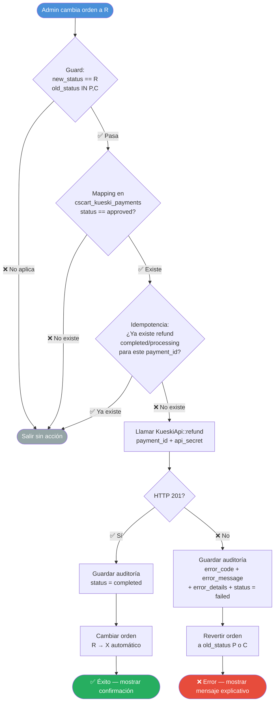

# Kueski Pay — CS-Cart
## Análisis y Diseño: Módulo de Reembolsos

**Versión:** 2.1 — **Fecha:** 2026-03-02  
**Responsables:** Víctor / Carlos  
**Estado:** Diseño Final — Bloqueado por certificación

---

## 1. Contexto
Los reembolsos no son requeridos para la certificación con Brenda (Success, Denied, 
Cancelled), pero son bloqueantes para Go-Live en producción. Este módulo permite 
procesar devoluciones totales integradas directamente con la API de Kueski Pay 
desde el panel de administración de CS-Cart.

## 2. Endpoint Kueski Pay

### 2.1 Request
| Parámetro | Valor |
| :--- | :--- |
| **Método** | POST |
| **URL (Producción)** | `https://api.kueskipay.com/api/refunds` |
| **URL (Sandbox)** | `https://payments-api.sandbox-pay.kueski.codes/api/refunds` |
| **Authorization** | Bearer {JWT} — firmado con api_secret (HS256) |
| **Content-Type** | application/json |

### 2.2 Body
| Campo | Tipo | Requerido | Descripción |
| :--- | :--- | :--- | :--- |
| `payment_id` | string | Sí | ID de pago de Kueski Pay. |
| `amount` | decimal | No | Monto a reembolsar. Si se omite, se reembolsa el total. |
| `reason` | string | No | `merchant_refund` (por defecto en este addon). |

### 2.3 Respuesta exitosa (HTTP 201)
| Campo | Tipo | Descripción |
| :--- | :--- | :--- |
| `status` | string | success o fail |
| `data.refund_id` | string | ID único del reembolso en Kueski. |
| `data.status` | string | completed o processing. |
| `data.amount` | decimal | Monto reembolsado. |

---

## 3. Constraints del API
- El reembolso debe procesarse dentro de los 100 días posteriores al pago.
- El reembolso debe estar dentro del año fiscal en curso.
- Solo puede haber un reembolso en procesamiento a la vez por `payment_id`.
- No se puede reembolsar si el cliente ya liquidó el préstamo completo.

---

## 4. Decisiones de diseño

### 4.1 Alcance — Primera versión
Se implementará únicamente el **reembolso total**. Se ha cerrado la decisión de 
doble estado: **'R'** (Refund solicitado, manual) y **'X'** (Reembolsado, automático). 
Se descarta el setting `refund_allowed_from` por no aplicar en v1.

### 4.2 Punto de disparo en CS-Cart
El reembolso se disparará cuando el administrador cambie manualmente el estado de 
una orden a **'R' (Reembolso solicitado)**. El hook `fn_change_order_status_post` 
actuará como guard con estas condiciones:
- `new_status == 'R'`
- `old_status IN ('P', 'C')`
- `cscart_kueski_payments.status == 'approved'`
- No existe un reembolso previo exitoso/en proceso para ese `payment_id`.
- La verificación lógica no sustituye la protección DB-level; el UNIQUE es la garantía final ante concurrencia.

*Nota: Se incluye 'C' (Complete) por ser el estado operativo post-entrega 
gestionado 100% por el admin.*

### 4.3 Auditoría
Se usará la tabla `cscart_kueski_refunds`. Se incluye el campo `old_status` para 
permitir revertir la orden al estado original (P o C) si la API falla.

### 4.4 Idempotencia
Defensa interna contra acciones duplicadas (doble-click/refresh) garantizada a dos 
niveles:
- **DB-level:** `UNIQUE KEY (order_id)` y `UNIQUE KEY (payment_id)` — ambos 
  necesarios porque la restricción oficial de Kueski es por `payment_id` y el 
  disparador operativo en CS-Cart es por `order_id`.
- **Lógica:** verificación en hook antes de INSERT.
**Nota: En caso de violación de UNIQUE (error SQL 1062), el addon debe capturar la excepción y tratarlo como operación ya procesada, evitando estado inconsistente.**

Kueski responde de forma síncrona (HTTP 201), por lo que no se esperan 
notificaciones asíncronas de refunds.

### 4.5 Manejo de errores (Guía 3.2 Refund Error Responses)

Cualquier respuesta HTTP distinta de 201 se considera un fallo de refund.
El addon debe:

- Guardar `error_code` (ej. `invalid-refund`, `payment-not-found`, 
  `invalid-request`).
- Guardar `error_message`.
- Guardar `error_details` (objeto `errors` serializado a JSON si existe).
- Revertir automáticamente la orden a `old_status` (P o C).
- No reintentar automáticamente el refund (operación financiera sensible).
- HTTP 401 se considera error de configuración (credenciales inválidas o JWT incorrecto).

### 4.6 JWT para refunds
Mismo mecanismo que el webhook response — `JwtService.php` sin cambios:
- **Algoritmo:** HS256
- **Payload:** `public_key`, `iat`, `exp = iat + 300s`, 
  `jti = SHA256(api_secret:iat)`
- **Firmado con:** `api_secret`

### 4.7 Excepción especializada
Se usa `KueskiRefundException` (en lugar de `RuntimeException`) para transportar 
metadata estructurada desde `KueskiApi::refund()` hasta el hook:
- `getHttpStatus()` — HTTP status de Kueski
- `getErrorCode()` — código de error
- `getErrorDetails()` — array del objeto `errors`
- `getErrorDetailsJson()` — serializado para guardar en DB

*Nota: `getCode()` heredado de `\Exception` retorna siempre 0 — 
`getHttpStatus()` es la única fuente del HTTP status.*

---

## 5. Arquitectura de implementación

### 5.1 Archivos a crear/modificar
| Archivo | Acción | Estado |
| :--- | :--- | :--- |
| `KueskiRefundException.php` | Crear | ✅ Cerrado |
| `KueskiApi.php` | Modificar — agregar `refund()` | ⏳ Pendiente Brenda |
| `func.php` | Modificar — hook + install/uninstall | ⏳ Pendiente |
| `init.php` | Modificar — registrar hook | ⏳ Pendiente |

### 5.2 Tabla `cscart_kueski_refunds` ✅ Cerrada
```sql
CREATE TABLE IF NOT EXISTS `cscart_kueski_refunds` (
    `id`            INT UNSIGNED    NOT NULL AUTO_INCREMENT,
    `order_id`      INT UNSIGNED    NOT NULL,
    `payment_id`    VARCHAR(64)     NOT NULL,
    `refund_id`     VARCHAR(64)     NULL,
    `amount`        DECIMAL(12,2)   NOT NULL,
    `reason`        VARCHAR(32)     NOT NULL DEFAULT 'merchant_refund',
    `status`        VARCHAR(32)     NOT NULL,
    `error_code`    VARCHAR(64)     NULL,
    `error_message` TEXT,
    `error_details` TEXT,
    `old_status`    VARCHAR(8)      NOT NULL,
    `created_at`    INT UNSIGNED    NOT NULL,
    PRIMARY KEY (`id`),
    UNIQUE KEY `uk_kueski_refunds_order`   (`order_id`),
    UNIQUE KEY `uk_kueski_refunds_payment` (`payment_id`),
    KEY        `idx_kueski_refunds_status` (`status`)
) ENGINE=InnoDB DEFAULT CHARSET=utf8mb4;
```

**Decisiones sobre constraints:**
- `UNIQUE KEY (order_id)` — protege contra doble-click desde CS-Cart
- `UNIQUE KEY (payment_id)` — refleja el contrato externo de Kueski
- `TEXT` sin `NULL` explícito — compatible MySQL 8.0.42/8.0.44 (MySQL 8 normaliza TEXT NULL DEFAULT NULL a TEXT, por lo que se deja en forma mínima.)
- `VARCHAR(32)` para `status` — flexible ante respuestas inesperadas de Kueski
- Índices adicionales (`refund_id`, `created_at`) descartados para v1

---

## 6. Flujo de ejecución
1. Admin cambia orden de **P** o **C** a **R** en panel CS-Cart.
2. CS-Cart dispara hook `fn_change_order_status_post`.
3. Hook valida guard: `new_status == 'R'` y `old_status IN ('P','C')`.
4. Hook verifica mapping aprobado en `cscart_kueski_payments`.
5. Hook verifica idempotencia en `cscart_kueski_refunds`.
6. Hook llama a `KueskiApi::refund($payment_id, $api_secret)`.
7. **Si HTTP 201:** Guarda datos en auditoría. Cambia estado de orden 
   **R → X** automáticamente. Muestra éxito.
8. **Si HTTP != 201 / error de red:** Guarda error en auditoría 
   (`error_code`, `error_message`, `error_details`). 
   **Revierte orden a old_status (P o C)**. Muestra error explicativo.

---
### 6.1 Diagrama de flujo

## 7. Mapa de estados de órdenes (CS-Cart 4.19.x)

> Fuente: `cscart_statuses` / `cscart_status_descriptions` (type = 'O') en esta instalación.
> Nota: Los registros pueden repetirse por idioma; el código es la referencia técnica.

| Código | Nombre (según DB) | Usado por Kueski |
| :--- | :--- | :--- |
| **A** | Fraud checking | No |
| **B** | Backordered | No |
| **C** | Complete | No — solo admin (post-entrega) |
| **D** | Declined | Sí — webhook denied |
| **F** | Failed | No — solo errores técnicos |
| **I** | Canceled | Sí — webhook canceled |
| **O** | Open | No |
| **P** | Paid | Sí — webhook approved |
| **Y** | Awaiting call | No |
| **R** | Reembolso solicitado | **Nuevo** — disparador addon |
| **X** | Reembolsado | **Nuevo** — éxito automático |

*Nota: 
- **N (Incompleta)** es un estado interno hardcoded. No usar 
como disparador.*
- Para refunds v1, el disparador es `new_status = R` y `old_status IN (P, C)`.  
- En esta instalación no aparece un estado `N (Incomplete)` como status configurable tipo 'O'; CS-Cart puede manejar órdenes incompletas internamente.
---

## 8. Pendientes antes de implementar
- ~~Confirmar URL sandbox endpoint refunds~~ — 
  **Validado empíricamente (2026-03-02):** HTTP 401 confirma existencia 
  y misma infraestructura (`istio-envoy`). URL confirmada ✅
- ~~Validar JwtService.php para refunds~~ — ✅ Validado, sin cambios
- **Certificación con Brenda** — ⏳ En espera. Prerrequisito para 
  modificar `KueskiApi.php` y archivos existentes.

---

## 9. Estimación
| Tarea | Estimación | Estado |
| :--- | :--- | :--- |
| `KueskiRefundException.php` | — | ✅ Completado |
| Tabla `cscart_kueski_refunds` | 1 hora | ✅ Diseño cerrado |
| `KueskiApi::refund()` + JWT | 2-3 horas | ⏳ Pendiente Brenda |
| Hook `fn_change_order_status_post` | 3-4 horas | ⏳ Pendiente |
| Install/Uninstall estados R y X | 1 hora | ⏳ Pendiente |
| Pruebas en Sandbox + evidencia | 3-4 horas | ⏳ Pendiente |
| **Total restante** | **~1.5 días** | |

---

## 10. Validación empírica — Sandbox Refund

**Fecha:** 2026-03-02

### Resultado
| Campo | Valor |
| :--- | :--- |
| **HTTP Status** | 201 Created ✅ |
| **order_id** | 312 |
| **payment_id** | 958105910192936 |
| **refund_id** | 958866366868266 |
| **status** | completed |
| **amount** | 7629.00 MXN |

### Conclusiones
- URL sandbox confirmada: 
  `https://payments-api.sandbox-pay.kueski.codes/api/refunds` ✅
- Autenticación JWT (HS256 con api_secret) funciona igual que webhook ✅
- Respuesta síncrona HTTP 201 confirmada ✅
- Campo `metadata: null` — no documentado en guía, ignorar ✅
- Sin campo `amount` en body → reembolso total confirmado ✅
- data.status = completed indica que sandbox no deja refunds en estado processing para este escenario.
